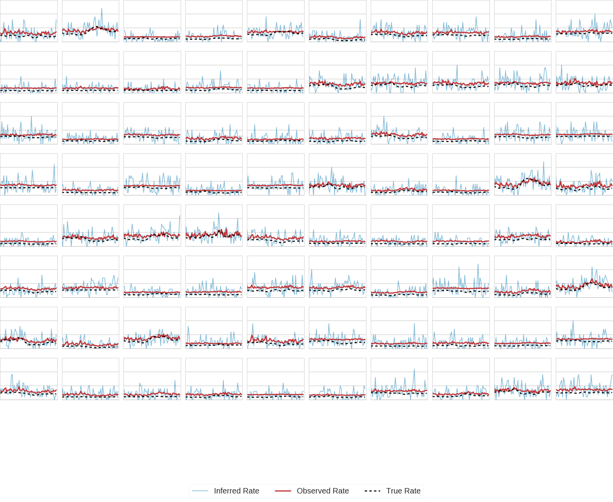

# Overview

## What it does

This package implements a poisson extension of gaussian process factor analysis (gpfa), which has been sucessfully applied to the analysis of data from motor cortex and other areas. The purpose of the model is to reduce the dimensionality of neural population activity data using plausible assumptions (e.g. that the firing rates of neurons are dependent on common inputs and that)

## Model structure

This model assumes that high dimensional population activity is driven by low-dimensional 'latent states', $\textbf{x}$. Latent states are modelled as gaussian processes ($\mathcal{GP}$) and are thus assumed to vary smoothly (on some timescale, which is inferred from data). Our prior distribution over latent states assumes they are independent, though this rarely holds in the posterior, it simplifies inference. The covariance of the state across timepoints is modelled, and hence the $\mathcal{GP}$ specified by the squared exponential kernel

$K(t_1,t_2) = \sigma_2^2 exp(\frac{- (t_1 -t_2)^2}{2\tau^2}) + \sigma_n^2 $

The firing rates of individual neurons, $\textbf{y}$, in a population linearly couple to these latent states (each neuron can have different 'coupling weights') according to $\textbf{C}$. All neurons also have a baseline firing rate $\textbf{d}$. Conditional on the values of the latent states at each timepoint, firing rates are assumed to be poisson distributed:

$\textbf{y}|\textbf{x} \sim \mathcal{P}(\textbf{y}|exp(\textbf{C}\textbf{x} + \textbf{d})$

## Results

### Simulated Data

### Real Data

### See GPFA_package notebook for example of use on simulated data
this code borrows (heavily) from Hooram Nam's implementation of the same algorithm
