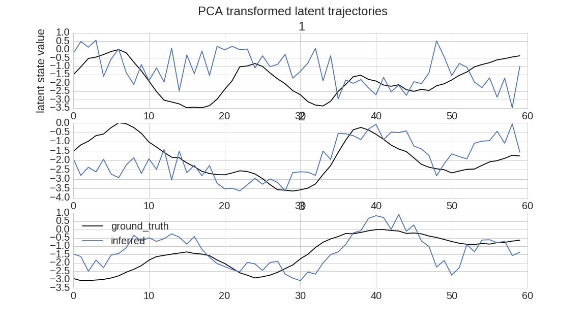

# Overview

## What it does

This package implements a poisson extension of gaussian process factor analysis (gpfa), which has been sucessfully applied to the analysis of data from motor cortex and other areas. The purpose of the model is to reduce the dimensionality of neural population activity data using plausible assumptions (e.g. that the firing rates of neurons are dependent on common inputs and that)

## Model structure

This model assumes that high dimensional population activity is driven by low-dimensional 'latent states', $\textbf{x}$. Latent states are modelled as gaussian processes ($\mathcal{GP}$) and are thus assumed to vary smoothly (on some timescale, which is inferred from data). Our prior distribution over latent states assumes they are independent, though this rarely holds in the posterior, it simplifies inference. The covariance of the state across timepoints is modelled, and hence the $\mathcal{GP}$ specified by the squared exponential kernel

$K(t_1,t_2) = \sigma_2^2 exp(\frac{- (t_1 -t_2)^2}{2\tau^2}) + \sigma_n^2 $

The firing rates of individual neurons, $\textbf{y}$, in a population linearly couple to these latent states (each neuron can have different 'coupling weights') according to $\textbf{C}$. All neurons also have a baseline firing rate $\textbf{d}$. Conditional on the values of the latent states at each timepoint, firing rates are assumed to be poisson distributed:

$\textbf{y}|\textbf{x} \sim \mathcal{P}(\textbf{y}|exp(\textbf{C}\textbf{x} + \textbf{d})$

## Results

All results below are on single trials. In the case of real data, this is cross-validated

### Simulated Data

#### Inferred Latent States

#### Inferred vs Ground Truth Latent States

#### Observed (blue), Underlying (black-dash) and Inferred (Orange) Firing Rates

### Real Data

#### Observed (blue), Underlying (black-dash) and Inferred (Orange) Firing Rates

### See GPFA_package notebook for example of use on simulated data

#This code borrows (heavily) from Hooram Nam's implementation of the same algorithm.

https://github.com/mackelab/poisson-gpfa

If you are interested in using the code, you are probably better off using their implementation for more choice of inference methods and more features. As far as has been tested, our code reproduce exactly the results of theirs  
Additional features beyond their have not been added here, yet. 
 :-)

#Copyright on parts of code from Macke lab

Copyright (c) 2015, mackelab All rights reserved.

Redistribution and use in source and binary forms, with or without modification, are permitted provided that the following conditions are met:

    Redistributions of source code must retain the above copyright notice, this list of conditions and the following disclaimer.

    Redistributions in binary form must reproduce the above copyright notice, this list of conditions and the following disclaimer in the documentation and/or other materials provided with the distribution.

THIS SOFTWARE IS PROVIDED BY THE COPYRIGHT HOLDERS AND CONTRIBUTORS "AS IS" AND ANY EXPRESS OR IMPLIED WARRANTIES, INCLUDING, BUT NOT LIMITED TO, THE IMPLIED WARRANTIES OF MERCHANTABILITY AND FITNESS FOR A PARTICULAR PURPOSE ARE DISCLAIMED. IN NO EVENT SHALL THE COPYRIGHT HOLDER OR CONTRIBUTORS BE LIABLE FOR ANY DIRECT, INDIRECT, INCIDENTAL, SPECIAL, EXEMPLARY, OR CONSEQUENTIAL DAMAGES (INCLUDING, BUT NOT LIMITED TO, PROCUREMENT OF SUBSTITUTE GOODS OR SERVICES; LOSS OF USE, DATA, OR PROFITS; OR BUSINESS INTERRUPTION) HOWEVER CAUSED AND ON ANY THEORY OF LIABILITY, WHETHER IN CONTRACT, STRICT LIABILITY, OR TORT (INCLUDING NEGLIGENCE OR OTHERWISE) ARISING IN ANY WAY OUT OF THE USE OF THIS SOFTWARE, EVEN IF ADVISED OF THE POSSIBILITY OF SUCH DAMAGE.

